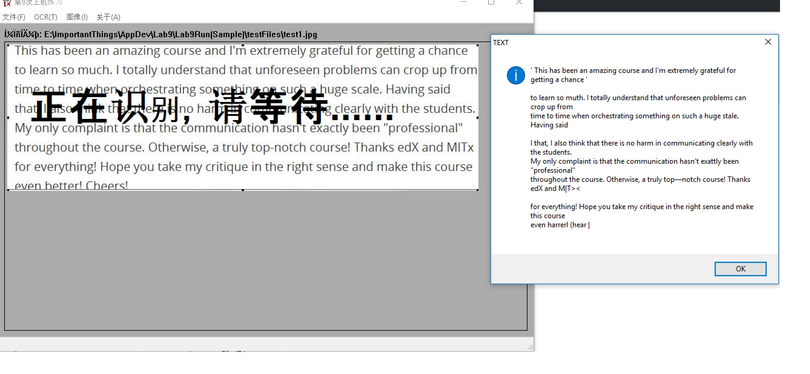

# tesseract-text-extraction-practice
This is a lab practice using tesseract to extract text info from image

you can directly run .exe 

Since it's a practice I've done several years ago, I can't find source code, if you are interested in any implementation details, contact me HanmingZhang@hotmail.com

